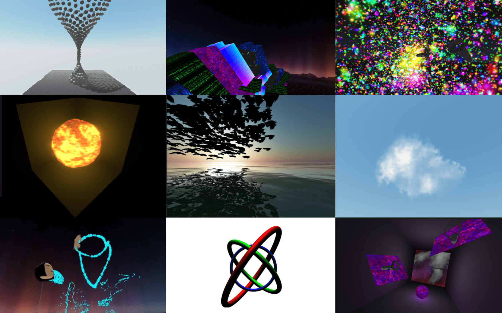

<h1 align="center"> Sandcastle </h1>
<h2 align="center"> A friendly framework for creating spatial-first, multi-user WebXR apps </h2>

## Features

- Built on vanilla [threeJS](http://threejs.org/)

- Made for WebXR (ergonomic XR [session & state management](https://github.com/plutovr/sandcastle/wiki#webxr-general-1) & easy [XR input event handling](https://github.com/plutovr/sandcastle/wiki#webxr-input-1))

- Built-in [Physics & Collision Detection](https://github.com/plutovr/sandcastle/wiki#physics-1) courtesy of [CannonJS](http://www.cannonjs.org/)

- Easy, WebRTC-based [networking & media streaming](https://github.com/plutovr/sandcastle/wiki#networking-1) courtesy of [ThreeNetwork](https://github.com/takahirox/ThreeNetwork)

- Designed for [XR Packages](https://github.com/webaverse/xrpackage) and shared WebXR experiences/multiapps

- Tiny project build sizes (~250kb gzipped before assets, way less than the image above!)

---

## Usage

Run `npm init sandcastle NAMEOFPROJECT` _OR_ `npx create-sandcastle NAMEOFPROJECT`, where `NAMEOFPROJECT` is your desired project name.

This will automatically:

1. clone this repo into a new folder of that name
2. install Sandcastle's dependencies
3. remove the `.git` repo
4. launch the dev server and
5. open the default scene (located at `./src/examples/defaultScene.js`) in your browser.

---

## Development & Building

- `npm start` will launch the dev server and open the sample scene.

- `npm build` will process and build your project into a `dist` folder.

- `npm build-xrpk` will `npm build`, then create an [XR Package](https://github.com/webaverse/xrpackage) in `dist`. (Note that this script runs an interactive CLI for details about the various aspects of your XR Package.)

---

## Learning Resources

- Check out the [Wiki](https://github.com/plutovr/sandcastle/wiki) for a closer look at Sandcastle's Networking API, Physics API, event handling and state management, asset pipelines and more.

- See the `examples` folder for usage examples of networking, media streaming, physics, AR-in-VR experiences and more.

#### This project is in pre-alpha and currently undergoes daily work. Is something broken or unclear? Please file an issue!
